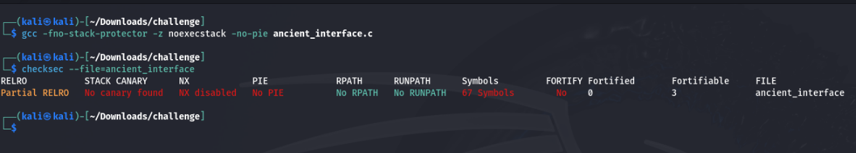
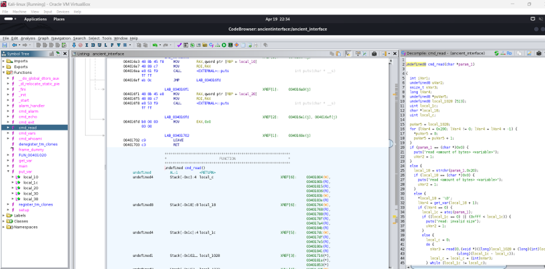
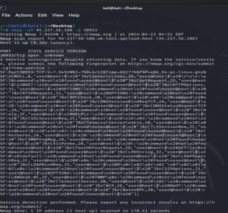
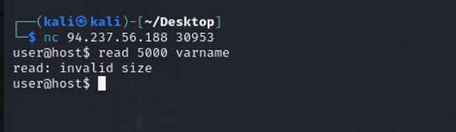
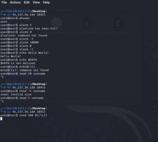
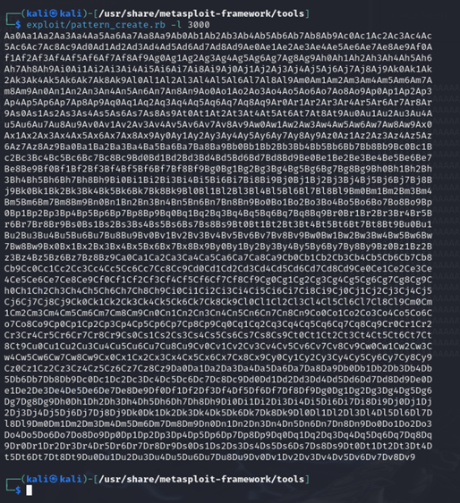
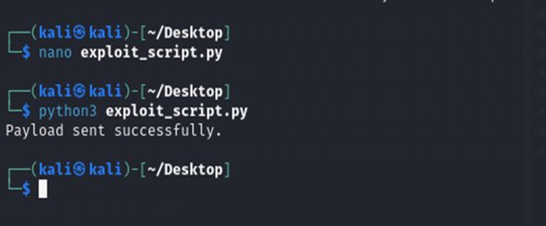

# Ancient-Interface
Medium Based Hack the box challenge
# Description
Ancient Interface“ in Hack the Box is a challenging virtual machine created to evaluate penetration tester proficiency. It's an assessment of your technical skills, creative thinking, and capability to tackle cybersecurity challenges. Successfully obtain root access to the Ancient Interface virtual machine on the Hack The Box platform by taking advantage of its weaknesses and carrying out all required actions to increase privileges and find out the flag through the interface by utilizing the proper commands or methods.
# Tools Used
Kali Linux,
 Nmap,
 Netcat,
 Ghidra,
 Metasploit.
# Outcomes
First, we have disabled pie and stack. Used -fno-stack-protector to turn off stack protection and -no-pie to turn off PIE during compilation with gcc.

For deconstructing the binary code concealed behind the interface, we utilised Ghidra for reverse engineering. The deconstruction
feature provided us with important insights into the logic and functions that were built.

Nmap command has been used to scan the target host to determine the running services.
"nmap -sV 94.237.56.188 -p 30953 " command used.

"netcat" command has been used to interact with the service.
"nc 94.237.56.188 30953" command used.

The "whoami" command return the name of "user" which showed correct functioning.The "alarm 5" input showed after some time that "Alarm has been hit !".This showed it correctly sets up the timer that triggers the intended response upon expiration.The echo command works as expected and shows resistance to basic environment variable injections.Read command is used for buffer overflow.

Automated scripted testing has been done using socket library.This is done to check any unexpected behavior like crashes or hangs.The memory errors and successful exploit indications are checked.The server echoed back the buffer sent and suggested the input is accepted.In second attempt it triggered an error condition for invalid size.

Use pattern_create to generate a unique sequence that fills the buffer. Command: /usr/share/metasploit-framework/tools/exploit/pattern_create.rb -l 3000 generates needed pattern.Inject pattern into application to identify exact overflow point impacting EIP.
Use pattern_offset with corrupted EIP value to find buffer overflow location.Command: /usr/share/metasploit-framework/tools/exploit/pattern_offset.rb -q EIP_VALUE finds offset.

Execute the prepared payload using Python script designed for remote buffer overflow. Command used for deploying exploit: python3 exploit_script.py sends buffer to target.Script establishes network connection, sends payload, and handles responses from the server. Python script uses socket programming to connect and transmit data to application.Upon execution, script sends NOP sled followed by shellcode across network stream.Server response post-exploit is captured; output indicates success or failure state. Received server outputs may include error messages, crash reports, or no response.If exploit fails, potential reasons include ASLR, DEP, or other security protections. Analysis of failure helps refine attack, adjust payload, or explore alternative strategies.

